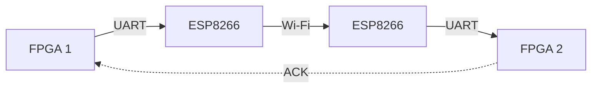

# FPGA-Based-real-time-Bidirectional-Communication-System

A hardware-in-the-loop platform for real-time FPGA communication over wireless networks using **UART, ESP8266 Wi-Fi, CRC-based error detection, and bidirectional communication**.

> **Current:** Wi-Fi-based communication
> **Future:** 5G integration and performance evaluation

---

## System Architecture



The **FPGA** handles the real-time control and communication logic, while the **ESP8266** provides wireless connectivity.

---

## Key Features

* FPGA-based packet generation and processing
* UART communication at **115200 baud**
* ESP8266-based Wi-Fi communication
* Bidirectional data transfer
* CRC-16/CCITT-FALSE error detection
* Event-based packet transmission
* Hardware status indication using LEDs and 7-segment display
* PC-based monitoring dashboard

---

## Packet Format

```text
A5 | EVENT | VEHICLE ID | CRC | 5A | 0A
```

| Field        | Description           |
| ------------ | --------------------- |
| `A5`         | Start of frame        |
| `EVENT`      | Event / packet type   |
| `VEHICLE ID` | Source identification |
| `CRC`        | Error detection       |
| `5A 0A`      | End of frame          |

**CRC:** CRC-16/CCITT-FALSE
**Polynomial:** `0x1021`
**Initial value:** `0xFFFF`

---

## Communication Flow

```text
Event Generated
      ↓
Packet Generation
      ↓
CRC Calculation
      ↓
UART Transmission
      ↓
ESP8266 → Wi-Fi
      ↓
ESP8266 → UART
      ↓
CRC Verification
      ↓
Packet Decoding
      ↓
ACK
```

---

## Hardware & Software

| Component        | Technology                      |
| ---------------- | ------------------------------- |
| FPGA             | Spartan-7 / RealDigital Boolean |
| Wireless         | ESP8266                         |
| Serial Interface | UART                            |
| HDL              | SystemVerilog                   |
| FPGA Tool        | Vivado                          |
| Monitoring       | PC Dashboard                    |

---

## Testing

The system is being evaluated for:

* Latency
* Packet loss
* Jitter
* ACK response time
* CRC error detection

---

## Roadmap

* [x] FPGA communication logic
* [x] UART interface
* [x] Packet protocol
* [x] CRC verification
* [x] ESP8266 Wi-Fi communication
* [X] Real-time commnunication
* [X] Bidirectional communication
* [ ] Performance characterization
* [ ] 5G integration
* [ ] Real-time industrial control demonstration

---

## Future Direction

The current Wi-Fi implementation provides a baseline for studying wireless communication in real-time control systems.

The next stage will investigate **5G connectivity** and compare it with the existing Wi-Fi implementation using measurable parameters such as latency, jitter, packet loss, and response time.

**FPGA → Wireless Communication → Performance Analysis → 5G**
